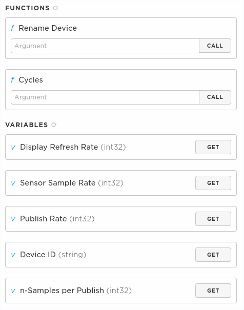

# MVP Firmware - Breakout [PRODUCT_ID(11339)]

## v1.2.3 - 6/25/2020

## New Features

### V1.2.3 - Updates | PRODUCT_VERSION(3) - Unpublished
- Add two functions draw_AsLogoL and draw_AsLogoS which draws the current Aerospec logo in black color. Can be used on the starting screen. 
    - I've consolidated functions into displayInit() to draw the logo on the start screen. Commented Jasmine's code to prevent bloat in the bin file incase we want to use it later. (Singh)

- Device now reports rolling average of samples before the publish. *n*  Samples will be summed , where *n* = PUBLISH_RATE/SAMPLE_RATE. Then the summation gets divided by *n* samples, giving the average. *n* can be grabbed using the particle console to verify the number of samples, even though it is automatically calculated. Each particle sensor sample is averaged individually.  

- Changed battery display to percentage. Also now shows the charging state of the device, shown after the battery percentage. The number displayed indicating the charging state corresponds to the items below:

    - BATTERY_STATE_UNKNOWN = 0
    - BATTERY_STATE_NOT_CHARGING = 1
    - BATTERY_STATE_CHARGING = 2
    - BATTERY_STATE_CHARGED = 3
    - BATTERY_STATE_DISCHARGING = 4
    - BATTERY_STATE_FAULT = 5
    - BATTERY_STATE_DISCONNECTED = 6

- Added signal strength to screen. 

- Changed format of the PM data. Also changed layout of information. Device info is displayed in red at the top. 

- Displayed time now shows PST. Recorded time is still in UTC. 

### V1.2.1 - Updates

- Can now publish. Added as new variable as a part of the `Cycles` function. To set the publish rate, it is now the third value in cycles. For instance:
    - Setting the device to a screen refresh rate of 60 seconds, sample time of 30 seconds and a publish rate of 60 minutes would be : `60,30,3600`, in seconds. 
    - You must enter all 3 parameters when updaing any of them. So changing only the sample time requires re-entering the values for the other two cycles.
    - Publishing will pull the latest data reguardles of the sample time. So if your publish cycle is shorter than your sample time, your publish data will be newer than the previous sample written to the SD card. 
    - Currently only one sample is sent, there is no aggregation of a sample set. 
    - Defualt publish time is 12 hours. 

- I attempted to fix the default EEPROM value, not sure if it works yet. Requires further testing. For now, when adding a new device, just set the values you want the cycles to be. 

- Changed I2C stale error detection from GPS to smallest PM sensor data. So if the PM 03 repeats the same value 60 times, the device will reset. 

- Testing the Firmware Publish on this version. Starting this Version as **PRODUCT_VERSION(1)**

### V1.2.0

- Can now set the sample and screen refresh rate via particle console. Use "Cycles" cloud function. Syntax is: screenRefresRate (s), sampleRefreshRate (s). 
    - Example : So setting the cycle times to a 60 second screen refresh rate and 30 second sample rate, you would enter : `60,30`
    - Not following this syntax will yield weird behaviors. If you do it correctly, it should return a 0. If it returns anything else, there was an error. 

- Can now set the Device ID via the console. Name must be less than 20 characters. Avoid using symbols, '-' seems to work fine. Use the "Rename Device" function. 

- You can now see the display, sample and device IDs assigned to the device. Click on Get buttons for each variable, it will report what is currently stored. 

- Sample rate, display rate and device ID will be stored on the device EEPROM, meaning it will store to onboard memory that will sustain resets or power downs. You only need to set it once. 

- PM Sensor will reset on stale I2C error. 

## Known Issues

- Power issue still persists. 

- Right now you must set the device ID and sample/refresh rates via the console. For some reason, it doesn't recongnize the default values set in EEPROM. It might be fixed as of now but should pay attention to this. This only needs to be done once, then the device should have a value stored in EEPROM. 

- Getting the Device ID from the particle console seems to be depreciated. Ignoring this feature for now, so you must change it yourself via the console every time. You can at least see what it is currently named to keep track of devices via the cloud variable. 

 **DO NOT WORK ON MASTER BRANCH.** Create your own branch first, remember to constantly pull. The reason for this is so if we are all working on the repo, your changes do not affect mine and vice versa. Also prevents merge conflicts later. 

 If you make changes to the master repo without telling anyone, they will get overwritten and your work will be lost. 

 Old repo has been archived.

